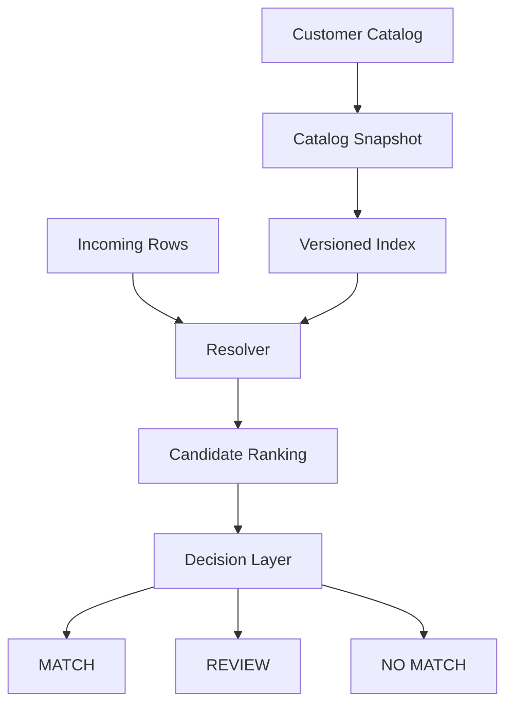

# Architecture

```mermaid
flowchart TD
    A[Customer Catalog] --> B[Catalog Snapshot]
    B --> C[Versioned Index]
    D[Incoming Rows] --> E[Resolver]
    C --> E
    E --> F[Candidate Ranking]
    F --> G[Decision Layer]
    G --> H[MATCH]
    G --> I[REVIEW]
    G --> J[NO MATCH]
```

CatalogForge is designed around customer-owned reference catalogs. Incoming rows are compared against a selected catalog version, ranked, and turned into an operational decision.
